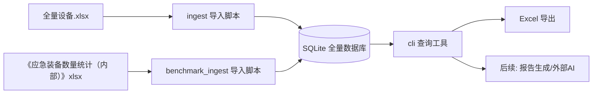

# 技术文档：系统架构与数据流转

- **编写日期**：2026-08-10
- **状态**：有效

## 1. 业务流程与架构图

## 2. 数据表设计

### devices（设备台账主表）
| 字段 | 说明 |
|---|---|
| id | 自增主键 |
| device_type | 设备类型（如 北斗终端） |
| device_name | 设备名称（布控球、指挥车等有，其他为空） |
| brand / model / satellite_info | 品牌、型号、卫星网络信息（指挥车等扩展字段） |
| unit_path | 原始使用单位完整路径（可追溯） |
| org_branch | 机构大类（业务通讯录 / 应急管理） |
| org_category | 机构分类（各区 / 横向委办局 / 企事业单位 / 社会侧 / 市应急管理局等） |
| region_category | 区划分类（市级委办局 / 区应急管理局 / 行政区划 / 其他 / 待定） |
| district | 区（归一化） |
| town | 街镇（归一化） |
| unit_name | 单位/村名（归一化，村民委员会→村委会） |
| status | 测试状态（待测试/正常/故障/维修中/已修复） |
| last_test_date / test_round | 最近测试日期与批次 |
| fault_desc / repair_status | 故障描述与维修状态 |
| source_file / source_sheet / source_row | 数据来源（文件、Sheet、行号） |
| updated_at | 更新时间 |

### unit_tags（标签表，预留）
| 字段 | 说明 |
|---|---|
| unit_name | 归一化单位名 |
| tag | 标签（如 风险村） |

### equipment_benchmark（基准汇总表）
| 字段 | 说明 |
|---|---|
| device_type | 设备类型（无人机、370MHz手持终端等） |
| district | 统计单位/区（市行为 天津市应急管理局） |
| metric | 口径：总数 / 市局配发 / 区局自购 / 配置总数 / 可用数量 |
| count | 数量 |
| source_file / source_sheet / source_row | 来源文件、Sheet、行号（可追溯） |

## 3. 使用单位归一化规则
1. 按 `/` 拆分路径，过滤空段
2. 机构大类：第 2 段（业务通讯录 / 应急管理）
3. 机构分类：业务通讯录下为 各区/横向委办局/企事业单位/社会侧；应急管理下为 市应急管理局 等
4. 区：匹配天津市 16 区白名单（如 宝坻区、北辰区），支持“北辰区应急管理局”这类包含区名的段
5. 街镇：段名以 镇/乡/街道/街 结尾
6. 单位：最后一个非结构性段；村民委员会/村委会统一为村委会
7. 区划分类：路径含「区应急管理局」→ 区应急管理局；横向委办局或应急管理直属 → 市级委办局；各区 → 行政区划；企事业单位/社会侧 → 其他；其余（含空单位）→ 待定
